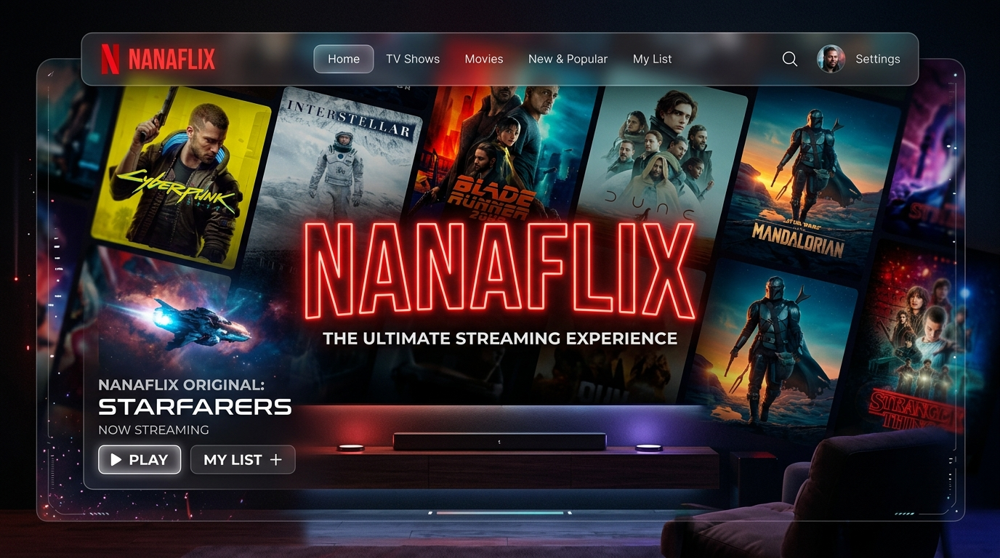
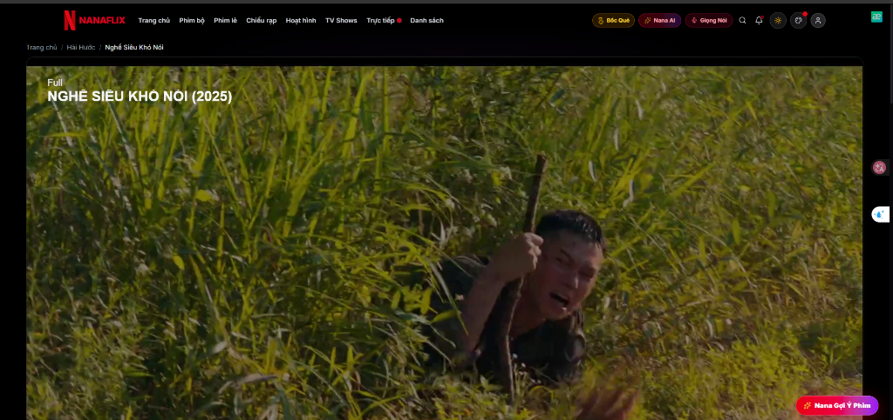
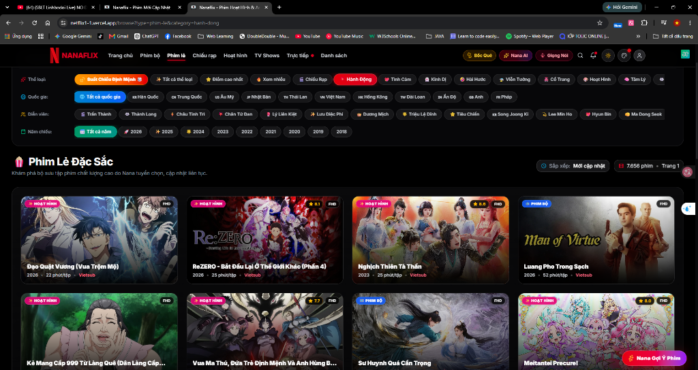
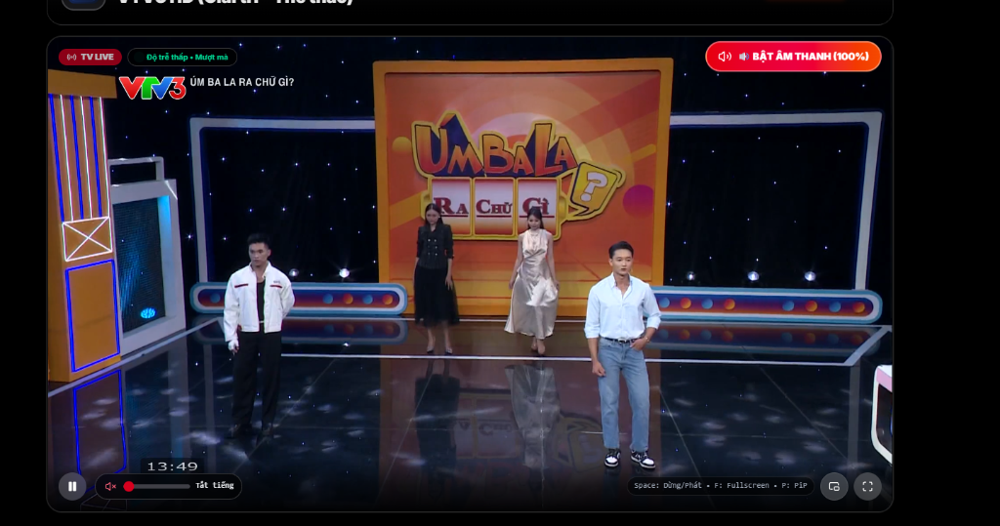

# Nanaflix

> A modern full-stack movie streaming and multimedia discovery platform built with Next.js 16, React 19, and a multi-tier caching architecture.

[](https://nextjs.org/)
[](https://react.dev/)
[](https://www.typescriptlang.org/)
[](https://tailwindcss.com/)
[](https://nanaflix.vercel.app)

**[Live Demo](https://nanaflix.vercel.app)** • **[GitHub Repository](https://github.com/dung122m/netflix1.1)**

---

<div align="center">
  
</div>

---

## About

**Nanaflix** is a full-stack media streaming web application designed to deliver a smooth cinema experience on modern browsers. Built with **Next.js 16 (App Router)** and **React 19**, the project addresses common challenges in media streaming applications: aggressive upstream API rate limits, unpredictable image payloads, responsive media playback, and persistent user synchronization.

The application aggregates multiple movie catalogs into a unified interface, featuring multi-dimensional filtering, fast search indexing, an adaptive HLS video player, personalized recommendation logic, and an AI-assisted movie concierge.

---

## Key Features

### 🎬 Movie Discovery & Filtering
- **Multi-Source Aggregation**: Combines movie sources (KKPhim & NguonC/VSMOV) with server-side title deduplication and quality prioritization.
- **Multi-Dimensional Filter**: Instant filtering across Movie Types (Movies, TV Series, Anime, TV Shows), Genres, Countries, Release Years, and Sort orders.
- **Search & Auto-Suggest**: Debounced keyword search with real-time query suggestions and actor profile lookups.

### ⚡ Streaming Player Experience
- **Adaptive HLS Engine**: Powered by `hls.js` with automatic quality switching, buffer stall recovery, and stream error handling.
- **Cinema Controls**: Theater Mode, Lights Off mode, Sleep Timer (15–60m), Picture-in-Picture (PiP), and keyboard shortcuts (`Space`, `F`, `T`, `L`, `P`, `N`).
- **Continue Watching**: Automatic timestamp persistence and watch progress tracking stored locally and synchronized with the cloud.

### 🌐 Live Sports & IPTV
- **Live Football Hub**: Live match schedules, fixture timelines (`Live`, `Next 2h`, `All`), and multi-server commentary feeds.
- **IPTV Channels**: National and regional live television streaming with custom SVG channel badges and status indicators.

### 👤 Personalization & Cloud Sync
- **User Library**: Watchlist, custom collections, watch history, and episode reminder notifications.
- **Hybrid Data Layer**: Local-first storage with optional cloud backup via Supabase and Firebase authentication.
- **Community Features**: Episode reviews, rating aggregations, and community engagement metrics.

### 🤖 AI-Assisted Discovery
- **Nana AI Concierge**: Conversational recommendation assistant powered by Google Gemini API to suggest titles by mood, plot elements, or actors.
- **AI Roulette**: Instant randomized recommendations with contextual rationale when users are undecided.

---

## Engineering Highlights

### 1. Multi-Tier Caching Architecture
To handle thousands of catalog queries without exceeding upstream rate limits or causing serverless cold-start bottlenecks, Nanaflix implements a layered caching strategy:

```text
Incoming Request
      │
      ▼
┌──────────────┐     HIT (0ms)
│ L1 In-Memory ├─────────────────► Return Response
└──────┬───────┘
       │ MISS
       ▼
┌──────────────┐     HIT (~15ms)
│ L2 Upstash   ├─────────────────► Populate L1 ──► Return Response
│ Redis (REST) │
└──────┬───────┘
       │ MISS
       ▼
┌──────────────┐
│ Single-Flight│ ───► Batches concurrent requests to prevent cache stampedes
│    Mutex     │
└──────┬───────┘
       │
       ▼
 Upstream APIs (KKPhim / NguonC)
```

- **L1 Memory Cache**: Node.js in-process LRU cache with sub-millisecond lookups for hot routes.
- **L2 Serverless Redis**: Upstash REST-based Redis client for persistent shared cache across edge/serverless instances.
- **Single-Flight Request Mutex**: Concurrent cache misses for the same movie key join a single in-flight Promise, eliminating redundant upstream requests.

### 2. Context-Aware Image Optimization Pipeline
Upstream media providers serve raw poster images varying from uncompressed 4K JPEGs to low-res thumbnails. Nanaflix normalizes all image traffic through a dedicated optimization pipeline:

```text
Raw Image URL
      │
      ▼
┌─────────────────────────────────┐
│ Context-Aware Sizing Logic      │ ──► Search: 192px | Card: 320px | Hero: 1280px
└──────────────┬──────────────────┘
               ▼
┌─────────────────────────────────┐
│ /api/img-thumb (Node.js/Sharp)  │ ──► WebP Conversion + In-Memory Image Buffer Cache
└──────────────┬──────────────────┘
               ▼
 Optimized Stream to Browser (~15–35KB vs original 1–3MB)
```

- **Hostname Allowlisting**: Strict origin checks to prevent proxy abuse and SSRF vulnerabilities.
- **In-Memory Image Cache**: 30-minute memory buffer for processed thumbnails to avoid redundant Sharp transformation cycles.

### 3. System Security & Anti-Exploit Guard
- **Anti-SSRF URL Guard**: Blocks requests targeting private IP subnets (`127.0.0.0/8`, `10.0.0.0/8`, `192.168.0.0/16`, link-local metadata) and non-standard ports.
- **Sliding Window Rate Limiter**: IP-based rate limiting on sensitive API routes (`/api/comments`, `/api/ai-concierge`, `/api/reports`) to mitigate spam and automated abuse.
- **Input Sanitization & Anti-XSS**: Multi-pass string sanitizer that neutralizes script injections, event handlers, and malicious URI schemes before database ingestion.
- **Row-Level Security (RLS)**: Fine-grained Supabase database access policies ensuring users can only read and mutate their own profile, history, and collection data.

---

## Architecture

```text
┌─────────────────────────────────────────────────────────────┐
│                       Client Layer                          │
│        React 19 Server & Client Components (Tailwind CSS)   │
└──────────────────────────────┬──────────────────────────────┘
                               │ HTTP / JSON
                               ▼
┌─────────────────────────────────────────────────────────────┐
│                 Next.js 16 App Router                       │
│  ┌───────────────────────┐       ┌────────────────────────┐ │
│  │   Pages & Layouts     │       │     API Route Handlers │ │
│  └───────────┬───────────┘       └───────────┬────────────┘ │
└──────────────┼───────────────────────────────┼──────────────┘
               │                               │
       ┌───────┴───────────────┐       ┌───────┴──────────────┐
       ▼                       ▼       ▼                      ▼
┌───────────────┐     ┌─────────────────┐     ┌────────────────┐
│ Multi-Tier    │     │ External Movie  │     │ Supabase DB    │
│ Cache Service │     │ Aggregator APIs │     │ PostgreSQL     │
│ (L1 + Redis)  │     │ (KKPhim/NguonC) │     │ (Auth + RLS)   │
└───────────────┘     └─────────────────┘     └────────────────┘
                               ▲                      ▲
                               │                      │
                      ┌────────┴────────┐    ┌────────┴────────┐
                      │ Google Gemini   │    │ Upstash Redis   │
                      │ Generative AI   │    │ Cache Cluster   │
                      └─────────────────┘    └─────────────────┘
```

---

## Tech Stack

| Layer | Technology | Purpose |
| :--- | :--- | :--- |
| **Framework** | Next.js 16 (App Router) | Server-side rendering, streaming SSR, and API route handlers |
| **Frontend** | React 19, TypeScript 5 | Component architecture, strict type safety |
| **Styling** | Tailwind CSS v4, Lucide Icons | Dark aesthetic, CSS variables, responsive design |
| **State & Motion** | Framer Motion, Context API | UI transitions and global player state management |
| **Caching** | In-Memory Map + Upstash Redis | Multi-tier L1/L2 caching with single-flight mutex |
| **Database & Auth** | Supabase (PostgreSQL) | User profile storage, watchlist, history, and RLS policies |
| **Media Engine** | HLS.js | Adaptive bitrate HLS streaming with auto-recovery |
| **Image Processing** | Sharp + Next.js Image Optimization | Server-side WebP compression and context resizing |
| **AI Integration** | Google Gemini API (`@google/genai`) | Movie concierge and conversational discovery |
| **Deployment** | Vercel | Production edge and serverless hosting |

---

## Performance Principles

- **Predictable Server Payloads**: Critical catalog data is fetched and rendered server-side with SWR headers to minimize client JavaScript overhead.
- **Lazy Hydration for Secondary Tabs**: Discovery carousels and ranking tabs load on demand when visible in the viewport.
- **Zero-Layout-Shift Media**: Aspect-ratio-constrained poster and thumbnail containers eliminate Cumulative Layout Shift (CLS).
- **Lightweight SVG Visuals**: Custom inline vector graphics used for channel logos and indicators instead of heavy external bitmap images.

---

## Project Structure

```text
src/
├── app/                  # Next.js App Router (pages, layouts, and API routes)
│   ├── api/              # Backend endpoints (AI concierge, image proxy, live sports, search)
│   ├── browse/           # Catalog explorer with multi-parameter filter
│   ├── live/             # Live football and IPTV streaming interfaces
│   ├── movies/[slug]/    # Movie detail view and cinema playback page
│   └── my-list/          # User library (Watchlist, History, Collections)
├── components/           # Reusable UI components (Player, Navbar, Modals, Cards)
│   ├── live/             # Live streaming specific components and scoreboards
│   └── ui/               # Base design system primitives (Dialog, Toast, Button)
├── services/             # Core business logic and external API integrations
│   ├── movies/           # Catalog aggregation, normalization, and deduplication
│   └── aiProviderService # Gemini AI integration and prompt engineering
└── lib/                  # Shared utilities, security guards, cache layers, and DB clients
    ├── cache/            # Multi-tier L1 memory and L2 Redis cache engine
    ├── movieMedia.ts     # Context-aware image URL resolution and sizing
    └── security.ts       # Anti-SSRF, rate limiter, and text sanitizers
```

---

## Visual Showcase

| Cinema Player (Viewport-Fitted) | Catalog & Multi-Filter |
| :---: | :---: |
|  |  |

| AI Assistant & Concierge | Live Football & IPTV |
| :---: | :---: |
|  |  |

---

## Local Development

### 1. Prerequisites
- **Node.js** `>= 20.0.0`
- Package manager: `npm` or `pnpm`

### 2. Installation

```bash
# Clone repository
git clone https://github.com/dung122m/netflix1.1.git
cd netflix1.1

# Install dependencies
npm install
```

### 3. Environment Setup
Create a `.env.local` file based on `.env.example`:

```env
# Upstream Movie APIs
NEXT_PUBLIC_API_URL=https://phim.nguonc.com/api
NEXT_PUBLIC_API_URL_2=https://phimapi.com

# AI Integration (Optional)
GEMINI_API_KEY=your_gemini_api_key

# Upstash Redis Cache (Optional - falls back to In-Memory L1)
UPSTASH_REDIS_REST_URL=https://your-database.upstash.io
UPSTASH_REDIS_REST_TOKEN=your_upstash_rest_token

# Supabase (Optional - for Cloud Sync & Auth)
NEXT_PUBLIC_SUPABASE_URL=your_supabase_url
NEXT_PUBLIC_SUPABASE_ANON_KEY=your_supabase_anon_key
```

### 4. Run Development Server

```bash
npm run dev
```

Open [http://localhost:3000](http://localhost:3000) in your browser.

### 5. Validation

```bash
npm run typecheck    # TypeScript compiler check
npm run lint         # ESLint validation
npm run build        # Production Next.js build
```

---

## Why I Built This

Nanaflix was created to explore the technical complexities of modern streaming platforms beyond standard tutorial applications. Building this project involved solving concrete engineering challenges:

1. **Handling Untrusted Upstream Data**: Transforming disparate API responses with inconsistent schemas into a unified, type-safe data model.
2. **Mitigating API Bottlenecks**: Designing a robust multi-tier caching system with request deduplication to prevent rate limiting.
3. **Optimizing Real-World Media Delivery**: Building an image pipeline with WebP conversion and context-aware sizing to reduce payload weights by over 80%.
4. **Delivering a Focused Cinema UX**: Implementing custom playback controls, keyboard navigation, ambient dimming, and zero-viewport-overflow player layouts.

---

## Author

**Dung Tran**  
*Full-Stack Developer*  
GitHub: [@dung122m](https://github.com/dung122m)

---

## License

This project is licensed under the [MIT License](LICENSE).
